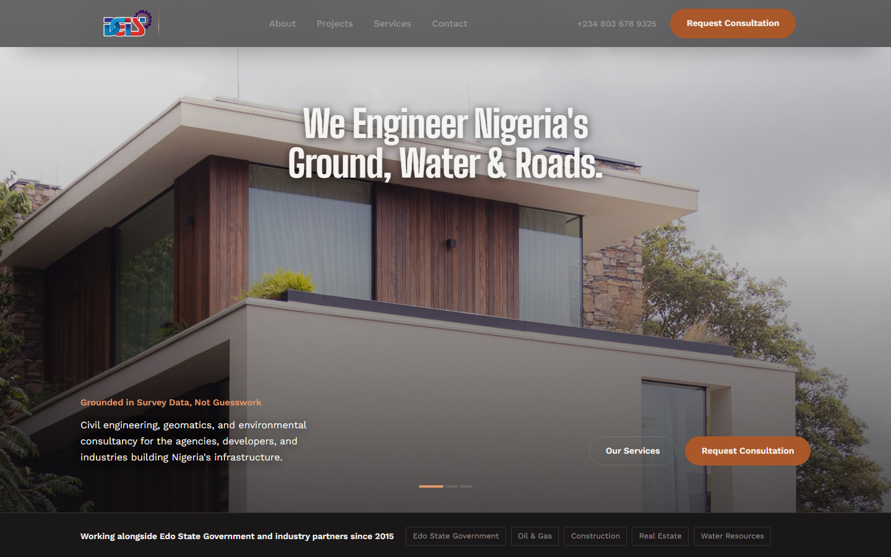

# Diarsa Global — Company Website

Marketing website for Diarsa Global, a civil-engineering and land-survey firm.
Built with React + Vite, with a custom dev-only content studio so non-technical
staff can update media and copy without touching code.

 <!-- add a real screenshot here -->

## Stack
- React + Vite
- Node.js (content studio backend)
- Vitest (unit tests), ESLint

## Features
- Responsive marketing site — services, projects, drone/aerial work, partners
- **Content Studio** (dev only): edit media slots and text with live preview;
  changes persist to JSON and upload to `public/media`
- Runs site + studio together via one command

## Local development

    npm install
    npm run dev   # Vite on :5173, studio server on :5174

## Engineering notes
- **Render-loop fix** — the media editor re-rendered on every route change because
  an effect depended on an unstable context object. Split the context and stabilised
  the callback with `useCallback`; navigation dropped from dozens of re-renders to
  3 commits.
- **Save-pipeline fix** — config validation rejected valid in-progress drafts and
  failed the whole save silently. Added draft pruning and surfaced server errors in
  the UI. Covered by 54 unit tests.
